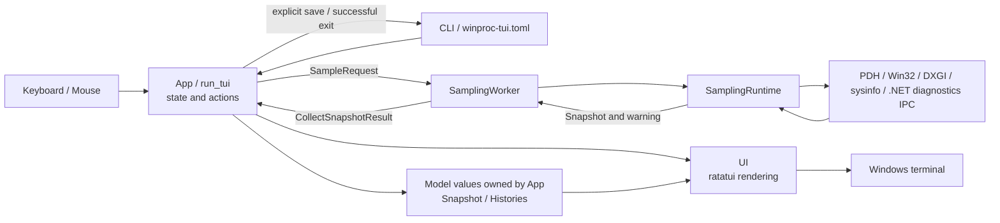

# winproc-tui Architecture

`winproc-tui` is a Windows 11 x64-only process monitoring TUI built with Rust 2024, ratatui, crossterm, Windows APIs, PDH, DXGI, and sysinfo.

This document is the entry point for system-wide responsibility boundaries, runtime data flow, and cross-cutting design decisions. Feature-specific state and invariants are owned by the related design documents:

- [Tracking and Live History](tracking-and-history.md): Current Investigation, profiles, tracking intent, process identity, Ghost Rows, and retention.
- [Graph Workspace](graph-workspace.md): Graph identity, shared time state, Samples, A/B comparison, and responsive layout.
- [Process Investigation](process-investigation.md): System Info, Process Info, Files, DLLs, Environment, and asynchronous target safety.
- [Recording and Log View](recording-and-log-view.md): activity transitions, session ownership, failure handling, and log loading.
- [Metrics](metrics.md): metric meanings, data sources, display formats, aggregation, and recording schemas.
- [.NET Runtime Metrics Collection](dotnet-metrics-collection.md): diagnostics IPC, EventPipe parsing, and runtime-specific collection details.

Product positioning, installation, and first-use workflows belong in the [README](../README.md) and [Japanese README](../README.ja.md). Complete controls belong in the in-app [Help](../src/ui/help.rs), contextual footers, implementation, and tests.

Maintainer release, Scoop, and Windows Package Manager procedures live in the [Release Workflow](release-workflow.md). The machine-readable schema for each current schema-v3 JSON Lines record lives under [`schemas/`](schemas/README.md).

## 1. Runtime Overview

`App` and the single-threaded `run_tui` event loop coordinate the application. Sampling and other potentially slow Windows operations run outside the UI thread and return typed results asynchronously.

This is a runtime data-flow diagram, not a strict Rust dependency graph. `ui` reads application state for rendering, while `app` also consumes geometry helpers from `ui::layout` so drawing and mouse hit testing use the same rectangles.

## 2. Component Boundaries

| Component | Responsibility |
|---|---|
| `main`, `cli`, `config`, `platform` | Process startup, single-instance enforcement, console control handling, terminal setup and restoration, CLI parsing, persistence, and small Windows helpers. |
| `app` | Main loop, application state, actions, navigation, recording, log loading, clipboard operations, and worker coordination. |
| `model` | UI-independent snapshots, process and system values, identities, column and sorting definitions, and history containers. |
| `samplers` | Collection through sysinfo, PDH, Win32, DXGI, .NET diagnostics IPC, and process-specific helpers; owns the sampling worker and runtime boundary. |
| `ui` | ratatui composition, panels and modals, formatting, themes, and shared screen geometry. |

`model` is the data layer and does not depend on `ui` or `samplers`. Samplers produce model values but never mutate `App` or widgets directly. `App` owns the active model state and coordinates all transitions.

## 3. Cross-Cutting Design Decisions

### 3.1 Keep the UI thread responsive

Windows counter, handle, module, file-metadata, remote-memory, and log operations can block or take variable time. Sampling, Process Info collection, log-directory scans, and full log loading therefore run on dedicated workers or bounded session threads.

Requests and results cross thread boundaries through typed channels or bounded latest-value caches. `App` allows only one sample request in flight, so a slow collection delays the next result instead of creating an unbounded queue.

Worker results carry enough identity, generation, or request information to reject stale results after selection, dialog, process-lifetime, or activity changes.

### 3.2 Keep state ownership centralized

`App` owns Live, paused, Recording, Log-list, and Log-view state. Display accessors select the appropriate snapshot and history without asking widgets to maintain activity-specific copies.

Long-lived user intent and per-process identity remain separate. The Current Investigation and named Investigation Profiles store reusable intent, while Graph sources, Recording scope, and Process Info targets preserve runtime identity where required.

### 3.3 Treat Windows data as best effort

Access restrictions, process exit, unsupported hardware, and counter failures produce unavailable values or warnings instead of failing the whole sample. Missing values remain explicit and are never replaced with plausible measurements. Formatting and recording omission rules are defined in [metrics.md](metrics.md).

### 3.4 Redraw only when visible state changes

`run_tui` is dirty-driven. It draws after input, resize, an applicable worker result, or another visible state transition rather than continuously between events.

Display pause freezes only the visible state. Sampling, histories, freshness, and Recording continue in the background. Log view owns separate loaded state and does not support display pause.

### 3.5 Preserve recoverable session data

Configuration is replaced only after a successful interactive run, while startup-setting and explicit Investigation Profile operations persist immediately. Recording uses appendable JSON Lines and preserves partial files after interruption or failure. Detailed persistence and lifecycle rules are defined by the relevant feature documents.

## 4. Runtime Flow

### 4.1 Startup and shutdown

1. `main` parses the CLI and acquires a Windows session-local named mutex. A second instance exits before terminal setup or configuration access.
2. The first instance installs the console control handler, resolves configuration, and enters raw mode and the alternate screen.
3. Investigation startup state is resolved before the first sample. Tracking intent and other identity-independent settings apply immediately. `App::new` then performs one synchronous initial collection and resolves saved Graph templates against that snapshot, assigning new runtime identities and Graph IDs.
4. `SamplingWorker` handles subsequent samples while `run_tui` uses the same terminal session.
5. After the loop returns, `main` restores the terminal and saves session configuration only when the run succeeded.

Interactive quit enters application cleanup. If Recording is active, the writer is finalized before exit. Console close, logoff, shutdown, `Ctrl+C`, and `Ctrl+Break` request the same cleanup path; close-class events wait for a bounded period. Dropping `SamplingWorker` sends `Stop` and joins its thread.

### 4.2 Main-loop cycle

Each `run_tui` iteration:

1. Applies completed sample, investigation, and log-worker results that still match current state.
2. Recalculates layout state and draws only when dirty.
3. Polls terminal input with a bounded wait so worker and termination results remain responsive.
4. Dispatches input to `App`; resize invalidates layout.
5. Requests the next sample when due, unless one is already in flight or Log view is active.

Applying a Live sample updates the aggregate `Snapshot`, process and system histories, exited-process state, visible-row caches when needed, and an active Recording accumulator. A warning may accompany an otherwise usable snapshot.

### 4.3 Sampling cycle

`SamplingRuntime::collect` refreshes sysinfo, samples system and per-process PDH counters, applies Win32 and DXGI values, and returns one `CollectSnapshotResult { snapshot, warning }`.

GPU Engine, process GPU memory, and adapter memory share a persistent query. Adapter identity and capacity are periodically rechecked so topology changes can replace cached static data. Slow per-process extras are sampled less frequently and reused between refreshes; exact intervals and values remain in [metrics.md](metrics.md).

.NET 8/9/10 sessions run independently per live `ProcessIdentity` and publish only complete recent intervals. They never update `App` directly and do not run in Log view. Protocol and fallback behavior are documented in [.NET Runtime Metrics Collection](dotnet-metrics-collection.md).

The collection boundary deliberately produces one aggregate `Snapshot`. Explicit process investigations remain outside normal sampling as described in [Process Investigation](process-investigation.md).

## 5. State Ownership

`App` owns these high-level state groups:

- sampling progress, current Live data, freshness, and warnings;
- process-table selection, filtering, sorting, columns, and visible-row caches;
- Current Investigation, named Investigation Profiles, tracking intent, histories, and exited rows;
- ordered Graphs and shared comparison state;
- modal and asynchronous investigation sessions;
- display pause, Recording, Log list, and Log view;
- runtime settings, theme, and transient feedback.

`Snapshot` is the aggregate value for one capture time. It contains optional system and process measurements so unavailability can be represented without fabricating a value. `ProcessHistory` is keyed by full process identity, while `SystemHistory` owns system Graph sources. Detailed retention and Graph-source rules are defined in the related design documents.

## 6. UI Boundary

Modal input has priority over underlying panels, and non-modal actions depend on the current focus state. Text editing and confirmation flows consume their own input instead of falling through to screen navigation.

`MENU` is top-level modal navigation, not a fourth user-visible activity. An otherwise-unhandled main-screen `Esc` or the leftmost mouse-accessible header control opens it in Live, Recording, or Log view, while existing dialogs and text-editing flows retain input priority. Its activity-specific hierarchy expands parents inline, permits multiple parents to remain expanded, omits unavailable actions, and exposes persistent startup behavior through Config. Menu actions reuse the same application transitions as their direct shortcuts and revalidate the activity that opened the menu before activation. Checkbox actions toggle in place without closing the menu. Sampling, freshness tracking, histories, and Recording continue while it is visible; Recording failures and automatic activity transitions dismiss it before presenting the higher-priority state.

Drawing and hit testing derive regions from shared layout helpers. Semantic interaction state stores identities or sources rather than screen coordinates, so scroll, resize, and filtering cannot retarget an action accidentally.

The UI module renders state and exposes geometry; it does not collect metrics or own histories. Exact keys, colors, emphasis, widths, marker shapes, focus order, and drawing positions remain in implementation and rendering tests.

## 7. Invariants and Tests

Cross-cutting invariants are:

- sampling and other expensive Windows work never block the UI thread;
- only one instance reaches terminal or configuration setup in a Windows session;
- `model` remains independent from UI and sampler implementation;
- unavailable data stays explicit;
- display pause does not pause sampling, histories, freshness, or Recording;
- asynchronous results are applied only to the state and identity that requested them;
- drawing and hit testing use the same geometry;
- terminal restoration and Recording cleanup remain part of normal and console-triggered exit paths.

Feature-specific invariants live in their respective design documents rather than being repeated here.

Unit tests live beside modules and in `src/main.rs`. `SamplingWorker::test_pair` supports asynchronous state tests without a real collector. ratatui `TestBackend` and buffer assertions cover layout, styling, and interaction-sensitive rendering.

## 8. Documentation Ownership

When behavior changes, update its canonical owner:

| Change | Canonical documentation |
|---|---|
| Product positioning, installation, first-use workflow | README and Japanese README |
| Complete controls and contextual actions | In-app Help, Footer, dialog guidance, implementation, and tests |
| Metric meaning, source, format, aggregation, recording field | [metrics.md](metrics.md) |
| Current Investigation, profiles, tracking intent, identity, history retention | [tracking-and-history.md](tracking-and-history.md) |
| Graph, Samples, A/B, and workspace layout state | [graph-workspace.md](graph-workspace.md) |
| System Info and Process Info collection lifecycle | [process-investigation.md](process-investigation.md) |
| Recording, log loading, and Log-view lifecycle | [recording-and-log-view.md](recording-and-log-view.md) |
| Cross-component responsibility or runtime flow | This document |
| Schema-v3 record shape | [`schemas/recording-v3-line.schema.json`](schemas/recording-v3-line.schema.json) and [metrics.md](metrics.md) |
| Release, Scoop, and Windows Package Manager publication | [release-workflow.md](release-workflow.md) |
| Agent workflow and regression rules | [AGENTS.md](../AGENTS.md) |
