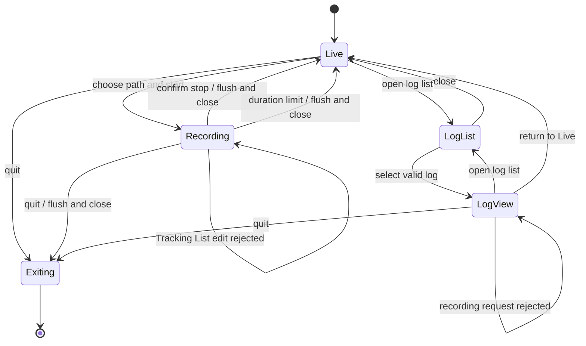

# Recording and Log View

This document defines the activity state machine, ownership, and lifecycle of Recording, log loading, and Log view. Metric fields, units, aggregation calculations, and JSON Lines schemas remain normative in [metrics.md](metrics.md). Tracking intent and working-list behavior remain in [tracking-and-history.md](tracking-and-history.md).

## Activities

The application has three user-visible activities: Live, Recording, and Log view. The Log list is a modal selection step, not a fourth activity.

Recording and Log view are mutually exclusive at both user-action and asynchronous-result boundaries. A completed background log load is rejected if Recording began while it was in flight.

## Recording Scope

Starting Recording requires at least one configured name in the working Tracking List. It does not require a currently matching process.

`RecordingSession` owns a copy of the working Tracking List and its normalized lookup set. Session metadata records that scope once, and every frame filters process samples through it. Tracking List edits are rejected until the session ends; Tracked-only remains available because it changes only the display.

When no configured name matches a live process, frames still contain system metrics and an empty process array. A configured name, a currently matching process, and one `(PID, name, start_time)` identity must remain distinct.

## Aggregation

Live sampling and Live history remain at one-second resolution. Recording independently selects a `1s`, `2s`, `5s`, or `10s` aggregation interval and owns the pending accumulator.

The current selector value is the default for the next Recording and is stored once as an application-wide preference. Opening or saving an Investigation Profile never changes it. Profile opening and saving are unavailable during Recording, and opening is unavailable in Log view. Profile deletion does not affect activity state.

Available values are averaged independently per process identity and GPU adapter. Missing values and absent processes do not contribute zero. Stopping, quitting, or reaching the duration limit flushes a partial final window before the clean end record.

The exact calculations, rounding rules, and schema fields are defined in [metrics.md](metrics.md).

## Stop, Quit, and Duration Limit

Opening the stop confirmation does not pause sampling or aggregation. Continuing dismisses the confirmation without changing the session; confirmed Stop flushes the pending aggregate, writes the end record, flushes the writer, closes the log, and returns to Live.

Interactive quit uses the same cleanup path rather than nesting another stop flow. Windows console close, logoff, shutdown, `Ctrl+C`, and `Ctrl+Break` request bounded cleanup through the main loop.

Each session lasts for at most 24 hours measured with a monotonic clock. At the limit, the application dismisses Recording-only dialogs, writes an end record with reason `duration_limit`, flushes and closes the log, and returns to Live without waiting for another sample.

## Failure Handling

Recording lifecycle failures are visible application state, not transient status messages.

- Create or open failure leaves the start dialog available behind the error.
- Header, frame, end-record, newline, or flush failure ends the active session and preserves the partial file.
- Cleanup failure during quit cancels the quit so the error remains visible.

The application never deletes a partial log solely because Recording failed.

## Log List and Loading

The Log list scans supported `*.log` files on a background worker. Only one full load can be in flight; additional open requests are ignored until its result is applied.

Schema versions 2 and 3 are listed and loadable. Malformed supported logs produce visible errors without crashing the UI. The schema-v3 loader resolves process and GPU IDs through preceding definition records while reconstructing snapshots and histories.

The loader retains the session interval and complete frame-time sequence so Log view can identify aggregated values and split Graph lines across missing process or metric windows.

## Log View Semantics

Log view is not frame playback. Processes shows the final process snapshot, while Graphs, Samples, Process Info, and A/B comparison inspect histories reconstructed from all complete frames.

Loaded histories are not pruned to Live-history capacities. Missing process or metric intervals remain gaps rather than being connected or replaced with nearby values. Process-specific live collectors remain disabled as described in [Process Investigation](process-investigation.md).

## Invariants

- Recording and Log view are never active together.
- One session uses one fixed Tracking List scope and one fixed aggregation interval.
- Loading a profile never changes either the current session interval or the default interval for a future Recording.
- Missing values and absent processes are never converted to zero.
- A partial final aggregation window is flushed before a clean end record.
- Recording ends and returns to Live after at most 24 hours of monotonic elapsed time.
- Stop and quit flush and close the writer; cleanup failure remains visible.
- Partial logs remain available after interruption or failure.
- Log view reconstructs histories but never plays frames over time.
